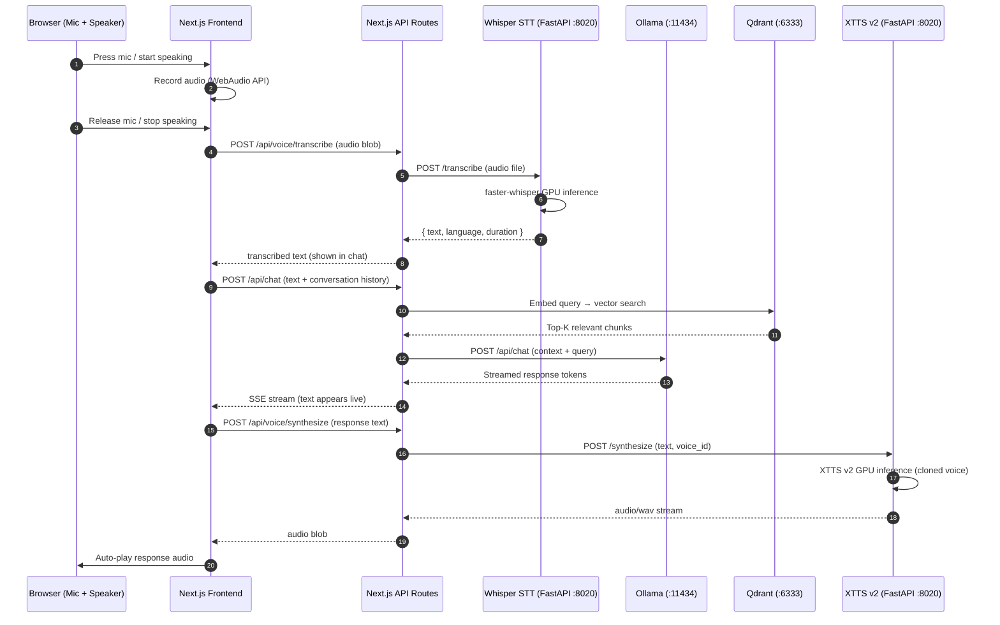

# VoxStation - System Architecture

**Voice-enabled AI chat with local Whisper STT, Ollama LLM + RAG, and cloned voice TTS**
**All running on Framestation GPU (RTX PRO 4500 Blackwell 32GB)**

---

## Overview

VoxStation is a full-duplex voice chat interface that lets you speak to your local AI and hear it respond in your cloned voice. It connects to your existing Framestation infrastructure (Ollama, Qdrant RAG, course library) and adds two new GPU-accelerated services: Whisper for speech-to-text and XTTS v2 for voice-cloned text-to-speech.

---

## System Diagram

```
┌─────────────────────────────────────────────────────────────────────┐
│                        VoxStation Frontend                          │
│                     Next.js 15 (any machine)                        │
│                                                                     │
│  ┌──────────────┐   ┌──────────────┐   ┌──────────────┐           │
│  │  Mic Input   │   │  Chat Panel  │   │  Audio       │           │
│  │  (WebAudio)  │   │  (Streaming) │   │  Playback    │           │
│  └──────┬───────┘   └──────┬───────┘   └──────▲───────┘           │
│         │                  │                   │                    │
│         │ audio blob       │ text stream       │ audio url         │
│         ▼                  ▼                   │                    │
│  ┌──────────────────────────────────────────────────────┐          │
│  │              Next.js API Routes                       │          │
│  │  POST /api/voice/transcribe  → Whisper STT           │          │
│  │  POST /api/chat              → Ollama + RAG          │          │
│  │  POST /api/voice/synthesize  → XTTS v2 TTS          │          │
│  │  POST /api/voice/pipeline    → Full loop endpoint    │          │
│  │  GET  /api/voice/voices      → List cloned voices    │          │
│  │  POST /api/voice/clone       → Upload voice sample   │          │
│  └──────────────────────────────────────────────────────┘          │
└─────────────────────────────────────────────────────────────────────┘
                              │
                              │ HTTP
                              ▼
┌─────────────────────────────────────────────────────────────────────┐
│              Framestation 395 (192.168.4.240)                       │
│              RTX PRO 4500 Blackwell 32GB VRAM                       │
│                                                                     │
│  ┌─────────────────────────────────────────────────────────────┐   │
│  │           VoxStation Voice Service (NEW)                     │   │
│  │           FastAPI — Port 8020                                │   │
│  │                                                               │   │
│  │  ┌──────────────────┐    ┌──────────────────┐              │   │
│  │  │  Whisper STT     │    │  XTTS v2 TTS     │              │   │
│  │  │  (faster-whisper) │    │  (Coqui TTS)     │              │   │
│  │  │                  │    │                   │              │   │
│  │  │  GPU: ~1-2GB     │    │  GPU: ~2-4GB      │              │   │
│  │  │  VRAM            │    │  VRAM             │              │   │
│  │  │                  │    │  + Voice Cloning  │              │   │
│  │  │  POST /transcribe│    │  POST /synthesize │              │   │
│  │  │  (audio → text)  │    │  (text → audio)   │              │   │
│  │  │                  │    │                   │              │   │
│  │  │  Models:         │    │  POST /clone      │              │   │
│  │  │  • large-v3      │    │  (upload samples) │              │   │
│  │  │  • medium        │    │                   │              │   │
│  │  │  • small         │    │  GET /voices      │              │   │
│  │  └──────────────────┘    └──────────────────┘              │   │
│  └─────────────────────────────────────────────────────────────┘   │
│                                                                     │
│  ┌──────────────────────┐  ┌──────────────────────┐               │
│  │  Ollama (EXISTING)   │  │  Qdrant (EXISTING)   │               │
│  │  Port 11434          │  │  Port 6333            │               │
│  │                      │  │                       │               │
│  │  Models:             │  │  Collections:          │               │
│  │  • qwen2.5:32b      │  │  • evergreen_kb (61)   │               │
│  │  • deepseek-v2       │  │  • rag_courses         │               │
│  │  • llama3.2:3b       │  │                       │               │
│  │  • nomic-embed-text  │  │                       │               │
│  └──────────────────────┘  └──────────────────────┘               │
│                                                                     │
│  ┌──────────────────────┐                                          │
│  │  MCP Server (EXIST)  │                                          │
│  │  Port 8008           │                                          │
│  │  rag_search tools    │                                          │
│  └──────────────────────┘                                          │
└─────────────────────────────────────────────────────────────────────┘
```

---

## Voice Pipeline Flow

### Full Loop: Speak → Think → Respond

```
┌─────────┐    audio    ┌──────────────┐    text     ┌──────────────┐
│  User   │───────────▶│  Whisper STT  │───────────▶│  Ollama LLM  │
│  Speaks │            │  (GPU)        │            │  + RAG Query  │
└─────────┘            └──────────────┘            └──────┬───────┘
                                                          │
                                                          │ response text
                                                          ▼
┌─────────┐   audio     ┌──────────────┐    text     ┌──────────────┐
│  User   │◀───────────│  XTTS v2 TTS │◀───────────│  Stream      │
│  Hears  │            │  (Your Voice) │            │  Response    │
└─────────┘            └──────────────┘            └──────────────┘
```

### Sequence Diagram



---

## Component Architecture

### Python Voice Service (FastAPI on Framestation)

```
voice-service/
├── main.py                    # FastAPI app, CORS, lifespan
├── config.py                  # Settings (ports, model paths, VRAM)
├── routers/
│   ├── transcribe.py          # POST /transcribe — Whisper STT
│   ├── synthesize.py          # POST /synthesize — XTTS v2 TTS
│   ├── voices.py              # GET /voices, POST /clone
│   └── health.py              # GET /health
├── services/
│   ├── whisper_service.py     # faster-whisper model management
│   ├── tts_service.py         # XTTS v2 model + voice management
│   └── gpu_monitor.py         # VRAM usage tracking
├── models/                    # Downloaded model weights (gitignored)
│   ├── whisper/
│   └── xtts/
├── voices/                    # Cloned voice reference samples
│   └── john/
│       ├── sample_01.wav
│       ├── sample_02.wav
│       └── speaker.pth        # Generated speaker embedding
├── requirements.txt
├── Dockerfile
└── docker-compose.yml
```

### Next.js Frontend

```
app/
├── layout.tsx                  # Root layout
├── page.tsx                    # Landing / redirect
├── (chat)/
│   ├── layout.tsx              # Chat shell with sidebar
│   ├── page.tsx                # New chat
│   └── [id]/
│       └── page.tsx            # Existing chat
├── api/
│   ├── chat/
│   │   └── route.ts           # LLM streaming via Ollama + RAG
│   └── voice/
│       ├── transcribe/
│       │   └── route.ts       # Proxy to Whisper service
│       ├── synthesize/
│       │   └── route.ts       # Proxy to TTS service
│       ├── voices/
│       │   └── route.ts       # List available voices
│       ├── clone/
│       │   └── route.ts       # Upload voice samples
│       └── pipeline/
│           └── route.ts       # Full loop: audio in → audio out
├── settings/
│   └── page.tsx                # Voice, model, RAG settings
components/
├── chat/
│   ├── chat-panel.tsx          # Main chat area
│   ├── message-list.tsx        # Scrollable message history
│   ├── message-bubble.tsx      # Single message with audio player
│   └── chat-input.tsx          # Text input + mic button
├── voice/
│   ├── mic-button.tsx          # Push-to-talk / voice activity detect
│   ├── audio-player.tsx        # Inline playback for TTS responses
│   ├── voice-indicator.tsx     # Recording/processing/speaking states
│   └── voice-settings.tsx      # Voice selection, auto-play toggle
├── layout/
│   ├── sidebar.tsx             # Chat history, settings nav
│   └── header.tsx              # Model selector, voice toggle
lib/
├── voice/
│   ├── recorder.ts             # WebAudio recording utilities
│   ├── audio-utils.ts          # Format conversion, playback
│   └── voice-client.ts        # API client for voice service
├── chat/
│   ├── ollama-client.ts        # Ollama API wrapper
│   ├── rag-client.ts           # Qdrant query helper
│   └── chat-store.ts           # Conversation state management
├── db/
│   ├── client.ts               # Drizzle + PostgreSQL (optional)
│   └── schema/
│       ├── chats.ts            # Chat sessions
│       ├── messages.ts         # Message history
│       └── voices.ts           # Voice profiles
└── utils.ts                    # cn(), helpers
```

---

## VRAM Budget (RTX PRO 4500 — 32GB)

| Service              | VRAM Estimate | Notes                        |
| -------------------- | ------------- | ---------------------------- |
| Whisper large-v3     | ~1.5 GB       | Best accuracy                |
| XTTS v2              | ~2-4 GB       | With speaker conditioning    |
| Ollama qwen2.5:32b   | ~20 GB        | Current primary model        |
| **Total**            | **~24-26 GB** | Fits comfortably in 32GB     |

All three services can run simultaneously. If you switch to a larger Ollama model, drop Whisper to `medium` (~1GB) to free headroom.

---

## Network Topology

| Service          | Port  | Host              | Status   |
| ---------------- | ----- | ----------------- | -------- |
| VoxStation Web   | 3050  | Mac or Framestation | NEW      |
| Voice Service    | 8020  | Framestation      | NEW      |
| Ollama           | 11434 | Framestation      | EXISTING |
| Qdrant           | 6333  | Framestation      | EXISTING |
| MCP Server       | 8008  | Framestation      | EXISTING |

---

## Environment Variables

### Next.js Frontend (.env.local)

```env
# Voice Service (Framestation)
VOICE_SERVICE_URL=http://192.168.4.240:8020

# Ollama (Framestation)
OLLAMA_BASE_URL=http://192.168.4.240:11434
OLLAMA_MODEL=qwen2.5:32b

# RAG / Qdrant (Framestation)
QDRANT_URL=http://192.168.4.240:6333
QDRANT_COLLECTION=evergreen_kb
EMBEDDING_MODEL=nomic-embed-text

# App
NEXT_PUBLIC_APP_URL=http://localhost:3050
PORT=3050
```

### Voice Service (.env)

```env
# Whisper
WHISPER_MODEL=large-v3
WHISPER_DEVICE=cuda
WHISPER_COMPUTE_TYPE=float16

# XTTS v2
XTTS_MODEL_PATH=./models/xtts
XTTS_DEVICE=cuda

# Voice samples
VOICES_DIR=./voices

# Server
HOST=0.0.0.0
PORT=8020
```

---

## Voice Cloning Setup

### How It Works

XTTS v2 uses a reference audio approach — no fine-tuning needed:

1. You provide 6-30 seconds of clean voice audio (WAV, 22050Hz)
2. XTTS extracts a speaker embedding from the reference
3. All future TTS uses that embedding to match your voice

### Recording Requirements

- **Duration:** 6-30 seconds per sample (longer = better match)
- **Format:** WAV, 22050Hz, mono
- **Content:** Read a paragraph naturally — varied intonation helps
- **Environment:** Quiet room, no background noise
- **Samples:** 1-5 samples recommended for best quality

### Voice Clone Endpoint

```bash
# Upload a voice sample
curl -X POST http://localhost:8020/clone \
  -F "name=john" \
  -F "audio=@my_voice_sample.wav"

# List available voices
curl http://localhost:8020/voices

# Synthesize with cloned voice
curl -X POST http://localhost:8020/synthesize \
  -H "Content-Type: application/json" \
  -d '{"text": "Hello from VoxStation", "voice_id": "john"}' \
  --output response.wav
```

---

## Tech Stack

| Component        | Technology             | Why                                  |
| ---------------- | ---------------------- | ------------------------------------ |
| Frontend         | Next.js 15, TypeScript | Matches your ecosystem               |
| Styling          | Tailwind CSS + shadcn  | Matches your ecosystem               |
| Voice Service    | FastAPI (Python)       | Best ML ecosystem, GPU libs          |
| STT              | faster-whisper         | CTranslate2 optimized, ~3x faster   |
| TTS              | Coqui XTTS v2         | Best open-source voice cloning       |
| LLM              | Ollama                 | Already running on Framestation      |
| RAG              | Qdrant + nomic-embed   | Already running on Framestation      |
| Audio Recording  | WebAudio API           | Browser-native, no dependencies      |
| Streaming        | Vercel AI SDK          | Matches AnotherWrapper patterns      |

---

## Deployment

### Voice Service (Framestation)

```bash
# SSH into Framestation
ssh lynf@192.168.4.240

# Clone and set up
cd ~
git clone https://github.com/johnfinleyproductions-lang/VoxStation.git
cd VoxStation/voice-service

# Create virtual environment
python -m venv .venv
source .venv/bin/activate

# Install dependencies
pip install -r requirements.txt

# Download models (first run)
python -c "from faster_whisper import WhisperModel; WhisperModel('large-v3', device='cuda')"

# Start service
uvicorn main:app --host 0.0.0.0 --port 8020
```

### Next.js Frontend (Mac or Framestation)

```bash
cd VoxStation
pnpm install
cp .env.example .env.local
# Edit .env.local with your Framestation IP
pnpm dev
```

---

## Future Enhancements

- **Voice Activity Detection (VAD):** Auto-detect when you start/stop speaking
- **Streaming TTS:** Start playing audio before full response is generated
- **Conversation memory:** Persist chat history in PostgreSQL
- **Multi-voice:** Clone multiple voices, switch in conversation
- **Wake word:** "Hey Vox" activation
- **Systemd service:** Auto-start voice service on Framestation boot
- **MCP integration:** Expose VoxStation as an MCP tool for other apps
